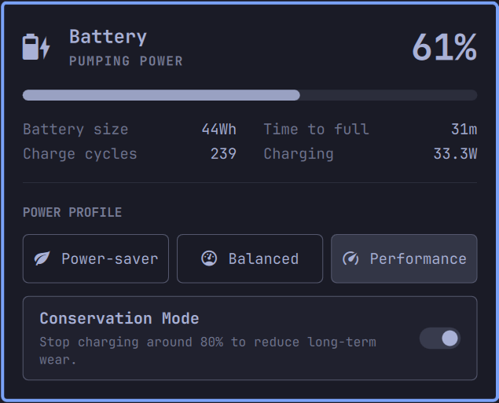

# Power - Lenovo Battery Conservation

Adds a Battery "Conservation Mode" toggle, for Lenovo laptops, to the Omarchy Quattro power bar plugin.  
_Tested on a ThinkBook 13x G2 IAP_

Uses the `ideapad_acpi` driver's `conservation_mode` setting, which stops charging around 80% instead of 100% and slows long-term battery wear on a machine that spends its life plugged in.



## What it does

- Adds a "Conservation Mode" toggle to the Omarchy Quattro default power bar plugin
  - Installing this plugin replaces the stock power bar plugin that ships with Omarchy. Removing this plugin restores the stock one
- Shows "Conservation Mode" status
  - whether it is on, off, or unknown (unknown would happen on unsupported platforms)
- Provides on/off "Conservation Mode" toggle
- Notifies on failure

## Install

> [!NOTE]
> This **replaces** the stock Power panel rather than sitting beside it, and
> removing this plugin brings the stock one back.

1. Add the plugin and enable it
1. Install the privileged helper
1. Restart the shell so the bar and plugins reload

```bash
omarchy plugin add https://github.com/justfortheloveof/omarchy-bar-plugin-power-lenovo-battery-conservation.git --enable
sudo ~/.config/omarchy/plugins/io.github.justfortheloveof.power-lenovo-battery-conservation/install.sh
omarchy-restart-shell
```

### Skipping the authentication

The toggle will prompt for your password using the Omarchy themed. If you would rather not authenticate on every click, copy the example rules file into place:

```bash
cd ~/.config/omarchy/plugins/io.github.justfortheloveof.power-lenovo-battery-conservation
sudo cp policy/lenovo-power-conservation.rules.example \
     /etc/polkit-1/rules.d/50-lenovo-power-conservation.rules
omarchy-restart-shell
cd -
```

It grants that one exact command line, `.../conservation set <0|1>`, **without any authentication** - on a local session, for members of wheel. Nothing else on the system changes, and deleting the file undoes it. This is a permanent passwordless grant, scoped exactly that tightly.

### Toggle UI Description

The Conservation Mode toggle sits at the bottom of the power panel.

The current mode is always described in words, and the switch beside it shows on or off. When the plugin cannot read the mode, the description says so, because the switch has no third position to show it in. A switch reading **off** next to a row calling the mode **unknown** means "not read", not "off" - read the sentence, not the switch.

| The description says | Switch | What is going on |
| --- | --- | --- |
| _Stop charging around 80% to reduce long-term wear._ | on or off | The mode was read, and that is the current value displayed by the switch (working as expected). |
| `Current mode unknown. Run sudo ./install.sh in the plugin directory to enable changes.` | off | `install.sh` has not been run, so the mode cannot be read at all - not even the current value. See [Install](#install). |
| `Current mode unknown: the attribute reported a value this plugin does not recognise.` | off | The attribute exists but reports something unexpected, so the plugin will not act on it rather than guess. |
| `No Lenovo conservation_mode attribute here, so conservation mode is always off.` | off | Not a Lenovo IdeaPad type platform. The mode does not exist on this machine, so off here is accurate. |

The three unknown states come from three different places, and only the first is something you can do anything about: the helper was never installed, the attribute reported an unexpected value, or the machine has no such attribute.

### CLI Usage

You can also check the "Conservation Mode" status and toggle it from the command line:

```bash
omarchy-shell omarchy.power conservationStatus   # on, off, or unknown
omarchy-shell omarchy.power toggleConservation   # prints the value it asked for
```

`conservationStatus` answers from what the panel last read: free and instant.

`toggleConservation` is asynchronous. It queues the write to a background process - the one that raises the dialog - and returns immediately, so its answer is the value it asked for, not the outcome: `0` or `1`, or nothing if it could not act. Dismiss the dialog and the mode is unchanged, quietly: that is an answer, not a fault, so it raises nothing. Any other failure does raise a notification. Either way the panel re-reads the attribute when the write finishes, so the row catches up by itself.

## Updating

```bash
omarchy plugin update io.github.justfortheloveof.power-lenovo-battery-conservation --yes
```

## Uninstalling / Removing

Removing the plugin restores the stock Power panel

```bash
sudo ~/.config/omarchy/plugins/io.github.justfortheloveof.power-lenovo-battery-conservation/uninstall.sh
omarchy plugin remove io.github.justfortheloveof.power-lenovo-battery-conservation --yes
```

- `omarchy plugin remove` only knows about files under `~/.config/omarchy/plugins`, so it leaves the root-owned helper - and the polkit rule, if you added one - on the system.
- `uninstall.sh` removes the helper, and if it finds the optional polkit rule it asks before removing that too. Answer `y` and both go; anything else leaves the rule alone and prints the command to remove it yourself.

## How the privileged part works

### Why a root-owned helper

Reading the current "Conservation Mode" needs no privilege: `conservation_mode` is world-readable. Writing it does, because the attribute is owned by root, and the kernel offers no unprivileged route to change it. Something has to run as root. Because the plugin directory is user writeable, we create a helper file that can only be modified by the root user so that it is not tampered with:

`install.sh` places a copy of `bin/lenovo-power-conservation` at `/usr/local/libexec/lenovo-power/conservation`, owned by root and writable by nobody else, and that installed copy is the only thing the plugin ever asks to be elevated.

### Why polkit and not sudo

So the prompt is the themed Omarchy dialog. Keeping the experience consistent.

By default, nothing is granted permanently. `pkexec` is used with the stock `org.freedesktop.policykit.exec` action, which is `auth_admin`, so **every toggle authenticates**. There is no sudoers entry involved. The [Skipping the authentication](#skipping-the-authentication) section is the deliberate, opt-in exception.

### What lands on disk, and how to remove it

`install.sh` installs exactly one file:

```
/usr/local/libexec/lenovo-power/conservation    root:root, mode 0755
```

Reading the mode fails until that file exists, because reading goes through the same helper: the row says a setup step is needed and the toggle stays disabled. Once it is installed, reading is silent and needs no password; only writing prompts.

There is a second file you may put on the system yourself, and `install.sh` never does it for you:

```
/etc/polkit-1/rules.d/50-lenovo-power-conservation.rules    only if you took the passwordless option
```

So `sudo ./uninstall.sh` deals with both: it removes the helper unconditionally, and offers you the polkit rule as well. It asks rather than assuming, because the rule is as likely to be something you wrote yourself as a copy of ours, and because leaving it behind keeps a passwordless grant pointing at a helper that is no longer there.

To remove it again, `sudo ./uninstall.sh`, or simply delete the file, since it keeps no state. `omarchy plugin remove` does **not** remove it: that only knows about files under `~/.config/omarchy/plugins`.

Both the helper and the optional rules file carry their source repository and licence in their header, so anything installed on your system says where it came from and how to remove it.

## Development

Everything about working on the plugin lives in [docs/CONTRIBUTING.md](docs/CONTRIBUTING.md)

## License

MIT - see `LICENSE`.

`Panel.qml` and `Model.js` are Copyright (c) David Heinemeier Hansson and Omarchy contributors, MIT licensed.
